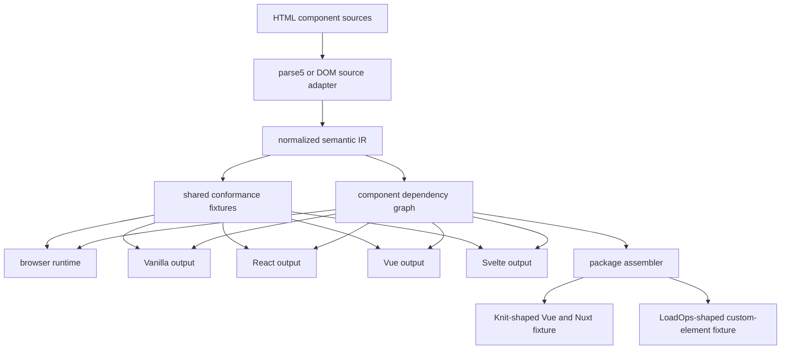
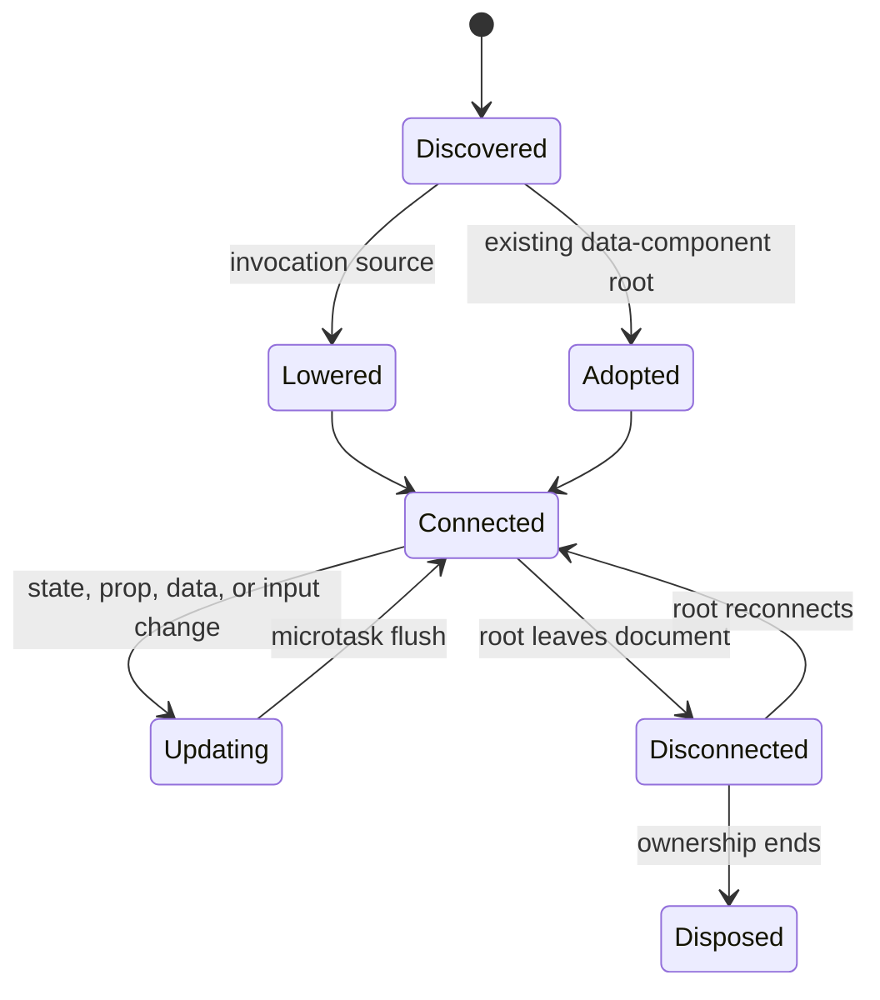
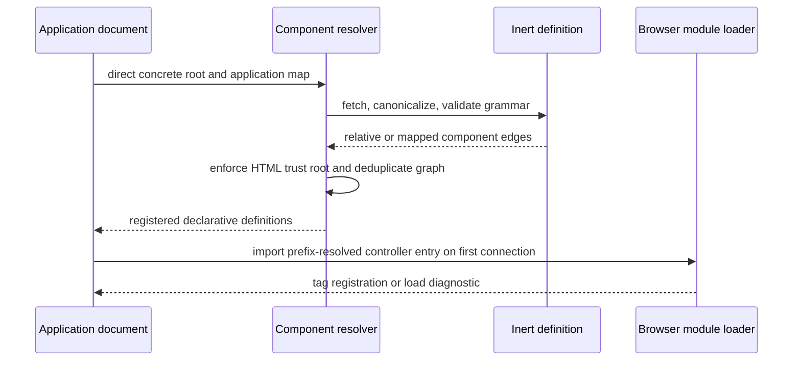
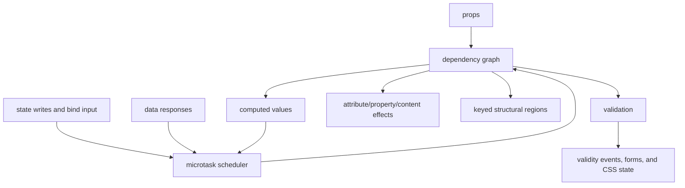

# Full HTML Next Reference Implementation - Plan

## Goal Capsule

- **Objective:** Looma can be migrated to HTML Next sources and emitted as a package that Knit and LoadOps can consume through their current custom-element, Vue, CSS, and JavaScript entry points, while the same language remains usable as a live browser polyfill and by the other framework targets.
- **Means:** Replace the divergent MVP parsers and proof-of-concept loader with one normalized language model, one dependency-graph compiler, a reactive browser host, target adapters, and a corpus-driven migration/package pipeline governed by the normative specification in this repository (KTD1-KTD10).
- **Authority:** The Product Contract in this plan governs scope; `docs/spec/` governs language behavior; conformance fixtures govern observable equivalence; implementation details may change without changing those contracts.
- **Execution profile:** Implement in dependency order, prove each language layer through shared conformance cases, and finish the work in this repository rather than leaving production behavior in the POC.
- **Stop condition:** Stop only for a contradiction in the confirmed product contract or a browser limitation that makes a stated behavior impossible without changing its author-facing contract.

---

## Product Contract

### Summary

Turn `@nextwebwg/html` from a component-generation MVP plus a separate loading demonstration into a reference implementation capable of replacing Looma's component implementation without forcing changes into Knit or LoadOps. The repository will own a modular normative specification, a CSP-compatible browser polyfill, a statically analyzable component-graph compiler, framework converters, the official generalized validation layer, and a package emitter that preserves ordinary non-component JavaScript and CSS exports.

### Problem Frame

The repository already proves several pieces independently: a parse5 compiler for primitive components, a browser-only parser for expressions and control flow, framework generators for the original prop-only IR, a validation shim, and a separate controller-loading POC. Those pieces disagree about the source grammar and stop at different maturity levels. The build parser still rejects syntax the browser path accepts, the browser path lowers only once, handlers and two-way bindings are inert, the POC owns the only dependency loader, generated targets omit the newer language, and the README still describes the original MVP.

The result is not yet a reference implementation: an author cannot take a component from the working draft and expect the live and compiled paths to agree. Validation also implements only a small scalar subset and exposes helper functions rather than the complete native-shaped behavior described by the draft.

Looma supplies the concrete baseline. Its 34 core components exercise named, fallback, and data-derived slots; controlled and uncontrolled values; reflected scalar and structured property values; rich custom events; public methods such as `validate()` and `focusInput()`; native form controls; observers, timers, abortable async providers, and overlay coordination; SSR hydration; light-DOM fallback contracts; and framework adapters. Knit consumes typed Vue and editor entry points, while LoadOps consumes side-effect custom-element registration plus layout and theme CSS. A build that cannot preserve both consumption shapes is incomplete even if smaller examples pass.

### Key Decisions

- **The implementation covers every concrete behavior in the confirmed draft, even where the draft labels controllers or validation experimental.** It excludes only explicitly unresolved directions whose observable behavior is not defined. Governs R1-R18.
- **Component definitions declare dependencies; applications own resolution and trust.** (session-settled: user-directed — chosen over component-carried approval flags, controller allowlists, and author-managed hashes: those mechanisms duplicate consumer policy and make reusable components hostile to development.) Governs R5-R7, R17.
- **Live and packaged consumption use the same statically discoverable graph.** (session-settled: user-directed — chosen over package-root registration scripts or opaque manifests: concrete HTML entries, component links, carrier controller attributes, and static ESM imports keep the graph inspectable.) Governs R5-R8, R15.
- **Controllers are ordinary trusted ESM, not a claimed sandbox.** (session-settled: user-approved — chosen over a fictional same-realm capability boundary: ESM supplies loading and graph semantics but does not remove page authority.) Governs R7, R9, R17.
- **Validation is an author-facing platform surface.** (session-settled: user-directed — chosen over requiring authors to use polyfill data attributes or to reimplement native validation: authors use validity objects, events, and validity pseudo-classes while the library carries compatibility.) Governs R12-R14.
- **The repository specification is library-agnostic.** (session-settled: user-directed — chosen over defining behavior by contrast with a specific template library: prior art belongs in examples or explicit comparisons, not normative rules.) Governs R1, R16.
- **Looma is the baseline conformance corpus, not a special case in the language.** (session-settled: user-directed — chosen over a demo-selected feature subset: the implementation must cover the reusable component patterns that Knit and LoadOps actually depend on.) Governs R4, R10-R13, R18, R21-R26.
- **Migration is partly mechanical and partly reviewed.** Stencil metadata, templates, styles, props, events, and slots may be extracted or scaffolded, but arbitrary TypeScript behavior is converted into explicit controller modules rather than being guessed by an unsafe source-to-source transpiler. Governs R21-R23.
- **HTML Next owns component artifacts, not unrelated application libraries.** A generated package may preserve declared static JavaScript, type, and CSS exports such as Looma's Tiptap extensions; those exports remain ordinary modules and are included in the inspectable package graph. Governs R19, R23-R26.

### Requirements

**Specification and conformance**

- R1. `docs/spec/` defines the supported grammar, parsing rules, value semantics, lifecycle, diagnostics, security boundary, validation behavior, target equivalence, and maturity of every included feature without depending on the website for normative meaning.
- R2. A machine-readable feature profile and shared fixtures identify what is required, experimental-but-implemented, and explicitly deferred; unsupported syntax fails with stable diagnostics rather than silently degrading.
- R3. Node compilation and browser execution consume equivalent normalized definitions and produce the same diagnostics for the same conforming or non-conforming source.

**Components, loading, and security**

- R4. Definitions support one optional `defs` region, one native or delegated component root, optional scoped style, props, state, computed values, data sources, handlers, default, named, fallback, and data-derived slots, polymorphic native roots, provenance, and prop reflection.
- R5. Inline definitions, `template[src]`, and document or definition `link[rel=component]` imports populate one document-level registry keyed by tag, with duplicate detection, cycle-safe URL deduplication, custom-element precedence, and demand-driven loading.
- R6. The build resolves concrete file and package-subpath entries, follows component and controller edges without executing source, and emits a deterministic graph whose output remains inspectable; no separate author-written contract or registration manifest is required.
- R7. A definition may declare one `controller` specifier on its carrier. The runtime loads it on first connection through the standard module loader, while builds preserve or bundle the ESM graph and generated framework targets run it through their host adapter.
- R8. Live cross-origin component HTML remains within an application-mapped, canonicalized URL prefix; HTML redirects and normalized path escapes fail, and imported definitions cannot add policy. A controller's declared entry URL must resolve inside that prefix, after which redirects and static imports are governed by native ESM, CORS, and CSP because the module loader exposes no pre-execution final-URL hook. Packaged builds do not pretend to use the live trust procedure.
- R9. Fetched definitions are parsed as inert data and reject script, import-map, base, policy-changing metadata, inline executable attributes, unsafe sinks, and other grammar escapes before any authored markup becomes live.

**Language and reactivity**

- R10. The expression parser provides the complete documented pure grammar, typed operators, object and list literals, first-class absence, static dependency extraction, declared-name checking, and non-throwing runtime data semantics without `eval` or ambient globals.
- R11. The runtime and every converter implement structural directives, escaped and sanitized content, formatting, one-way/property-resolved bindings, two-way writable-state bindings, class/style bindings, keyed reconciliation, named declarative handlers, event modifiers, dispatch, lifecycle handlers, component events, and expression-bound slot selection.
- R12. State changes batch in a microtask, computed values invalidate from declared dependencies, DOM updates affect only dependent bindings, keyed lists preserve identity, controlled and uncontrolled props reconcile predictably, controller effects clean up, and already-lowered server DOM is adopted rather than replaced.
- R13. Declared data reads serialize URI-template and query parameters, cancel stale requests, expose pending/value/error/ok state, support debounce and polling, validate typed responses, and trigger reactive dependents. Enhanced forms retain native submission semantics when enhancement is unavailable and expose the same async state when enhanced.

**Types and validation**

- R14. The type system parses and serializes the fully documented scalar, keyword, collection, structured, web-value, nullable, and trusted-content forms at typed boundaries, with useful source diagnostics and TypeScript projections.
- R15. `validate()` supports the included type grammar, native HTML constraints and input value spaces—including email and URL syntax—ranges, length, pattern, step, structured paths, schemas, and an open error-reason list while preserving native `ValidityState` interop.
- R16. The DOM validation adapter keeps validity current as bound values change; exposes native-shaped validity, message, explicit validate/set-validity operations, invalid events, interaction state, and form submission blocking; delegates to native controls and `ElementInternals` where available.
- R17. Authors style `:valid`, `:invalid`, and `:user-invalid`. Generated CSS and the browser runtime transparently mirror selectors for elements browsers cannot validate natively, including dynamically added and external same-origin styles that can be read safely.

**Converters and delivery**

- R18. Vanilla, React, Vue, and Svelte outputs preserve native roots, scalar and property-only structured props, named/fallback/data-derived slots, directives, reactivity, typed events, public methods, validation, scoped styles, controllers, lifecycle, hydration markers, and dependency imports with no semantic wrapper and with target-native public types.
- R19. The CLI can check, build, and inspect a complete component dependency graph; select targets; emit deterministic artifacts and dependency metadata; report source-located diagnostics; and never execute a controller while analyzing the graph.
- R20. Examples, generated fixtures, package exports, and contributor documentation demonstrate no-build live use, installed-package builds, framework consumption, validation, controllers, nested composition, SSR adoption, and the security boundary without presenting POC-only behavior as shipped.

**Looma migration and consumer compatibility**

- R21. A checked-in Looma compatibility inventory, derived from its public Stencil metadata and package exports, records every component prop, event, public method, slot shape, style asset, and non-component export required by the migration; drift is reported explicitly and every one of the 34 public core components has a reviewed migration disposition.
- R22. The authoring and controller surfaces can express Looma's capability classes: semantic wrappers, form controls, controlled composites, async/provider-driven composites, menus/dialogs/tooltips/popovers, tree interaction, layout primitives, and editor UI integration.
- R23. A migration command can scaffold statically recoverable Stencil contracts and CSS into HTML Next sources, emit reviewed controller boundaries for imperative behavior, and refuse to claim automatic conversion where behavior cannot be preserved mechanically.
- R24. Package generation emits a Looma-shaped ESM package only after every included public core component is behaviorally ported and tested. It provides side-effect custom-element registration, concrete HTML component entries, generated public types, Vue adapters with idiomatic props/events/slots/exposed methods, CSS/theme/layout assets, and declared pass-through JavaScript/type exports. A reviewed exclusion is allowed only for an artifact proven outside Looma's current public package contract.
- R25. A Knit-shaped Nuxt/Vue fixture consumes the generated `/vue`, `/vue/editor`, and `/editor/extensions` surfaces, including `v-model`, named and scoped slots, event detail mapping, editor integrations, SSR output, and hydration without application-specific adapters.
- R26. A LoadOps-shaped Nuxt/Vue fixture consumes the generated package root and `/layout` as side-effect registrations, renders the currently used `ui-*` tags and native slotted controls, imports the existing CSS entry points, and preserves native email/date/number validation and form submission behavior.

### Success Criteria

- Every syntax example designated supported in `docs/spec/` parses through the shared conformance corpus and either runs in all browser engines or compiles for every applicable target.
- A stateful nested example with a controller, data dependency, form validation, and scoped styles has equivalent observable DOM and events under the browser runtime and generated targets.
- Native `input[type=email]` behavior and generalized non-control validation produce the same HTML Next reason model, and author-written validity selectors work without polyfill-specific CSS.
- No production feature depends on `examples/poc/poc.js`; the POC is retired or reduced to an example using public library APIs.
- The Looma inventory reports all 34 core component definitions and every public package export; no unsupported capability is hidden by a successful scaffold.
- A generated Looma-compatibility package installs into isolated Knit- and LoadOps-shaped Nuxt consumers without aliases, consumer patches, or application-local component shims.

### Scope Boundaries

Included despite experimental maturity because the user explicitly requested a working reference implementation: controllers, the host adapter, generalized validation, typed data reads, enhanced form writes, hydration adoption, and the concrete loading/trust model.

#### Deferred to Follow-Up Work

- Runtime-selected `component[is]`, arbitrary portals, and optional Shadow DOM remain deferred where their observable contract is not required to preserve Looma's public light-DOM fallback behavior. Named, fallback, data-derived, and framework-scoped slot interoperability are part of the baseline.
- Real-time SSE/WebSocket data, routing, pagination accumulation, optimistic updates, cache revalidation policy, custom request headers/auth configuration, and reactive-state-gated definition waterfalls remain deferred because the working draft explicitly calls them open.
- Browser-native standardization work, publishing an npm release, and mirroring the repository specification back into the public site are separate delivery actions.
- Rewriting Tiptap, Valibot, icon libraries, or other ordinary JavaScript dependencies into HTML is not required. Their package edges must remain explicit, buildable, and consumable alongside generated components.

### Acceptance Examples

- AE1. Given a live page with an application import-map prefix and one concrete component root, when nested definitions and a controller are needed, then component HTML and the declared controller entry stay within the mapped prefix, the controller loads once through native ESM under browser redirect/import/CORS/CSP policy, and an attempted definition-carried import map is rejected. Covers R5-R9.
- AE2. Given an installed package exporting a concrete HTML component subpath, when the CLI builds it, then relative component edges and controller/static ESM edges appear in the analyzed graph and all selected artifacts build without a browser import map or executed code. Covers R6-R8, R19.
- AE3. Given a counter with state, computed output, handlers, `bind:`, class/style bindings, and a keyed list, when the user changes input and invokes handlers, then dependent output updates once per microtask and keyed node identity survives reordering. Covers R10-R12.
- AE4. Given native and non-control elements constrained as email, number, and structured data, when invalid values are entered or assigned, then current validity contains typed reasons and paths, form submission is blocked where applicable, `invalid` fires correctly, and authored `:user-invalid` styling becomes visible only after interaction. Covers R14-R17.
- AE5. Given server-lowered markup with provenance and reflected props, when the browser runtime starts, then it adopts the existing roots, attaches handlers/controllers, and does not replace user-visible nodes. Covers R4, R7, R12, R18.
- AE6. Given one conforming source graph, when it runs live and is generated for Vanilla, React, Vue, and Svelte, then each path has the same native root, effective attributes/properties, ordered content, events, validity, component lineage, and scoped-style boundaries. Covers R3, R11-R13, R17-R20.
- AE7. Given the Looma public component metadata, package exports, and CSS surface, when migration inspection runs, then all 34 core components are classified, every prop/event/method/slot is accounted for, ordinary editor extension modules are preserved as explicit pass-through edges, and any behavior needing a reviewed controller is named rather than silently dropped. Covers R21-R24.
- AE8. Given the generated Looma-compatible package, when the Knit-shaped fixture imports `@threadlabs/looma/vue`, `/vue/editor`, and `/editor/extensions`, then representative primitive, dialog/menu, search, form, and editor flows compile, SSR-render, hydrate, dispatch typed events, and expose public methods without a consumer shim. Covers R18, R22-R25.
- AE9. Given the same generated package, when the LoadOps-shaped fixture imports the package root, `/layout`, and the current theme/style entry points, then its directly authored `ui-button`, `ui-input`, `ui-select`, `ui-form-field`, `ui-popover`, and layout elements upgrade and preserve native slotted-control validation. Covers R14-R18, R22, R24, R26.

---

## Planning Contract

### Key Technical Decisions

- KTD1. **Repository-owned modular specification.** Add `docs/spec/` with an index, language modules, algorithms, security, validation, target equivalence, and a support matrix. The public site is research and presentation input; this repository becomes the implementation-pinned normative source for R1-R3 and R20.
- KTD2. **One serializable semantic IR.** Replace the contract/template split and browser-only parser with a source-adapter architecture: parse5 and DOM adapters feed the same definition builder, expression AST, declaration graph, template nodes, dependency edges, diagnostics, and source provenance. Browser execution may retain DOM nodes for identity, but it may not own a second language grammar.
- KTD3. **Graph resolution separated from parsing.** A resolver receives application-owned entry and resolution policy, canonicalizes final response URLs, validates declarative edges against their trust root, detects duplicates/cycles, and returns an immutable component graph. Node and browser resolvers share graph rules but use environment-specific fetch/package-resolution adapters. (session-settled: user-directed — chosen over package registration scripts, opaque manifests, and definition-carried permissions: it keeps live and packaged dependency discovery explicit without burdening component authors.)
- KTD4. **Fine-grained reactive execution plan.** Compile every binding and declaration to a dependency list plus an update operation. Runtime cells schedule dirty computations and DOM effects once per microtask; structural regions own keyed child ranges and lifecycle cleanup. Framework generators consume the same execution plan and express it in target-native primitives rather than re-parsing expressions.
- KTD5. **Controllers use a stable host adapter.** A tag-keyed controller registry supplies state, refs, named form elements, events, effects, dispatch, connection, and teardown for browser and framework targets. Controller modules remain ordinary ESM with page authority. (session-settled: user-approved — chosen over claiming same-realm ESM is a sandbox: the design is honest about risk while retaining the normal module toolchain.)
- KTD6. **Safe content is centralized.** All HTML-bearing operations pass through one sanitizer abstraction that prefers the standard Sanitizer API and has a fully tested fallback. Contextual URL/style/property policies and Trusted Types integration are separate sinks. Definitions and `$html` content never enter the registration path interchangeably.
- KTD7. **Validation is a first-class subsystem.** Use one typed constraint compiler and issue model for props, controls, data, and schemas. A DOM facade delegates to native validation when possible and installs non-enumerable element methods/properties only within managed component roots; selector rewriting is emitted at build time and mirrored for readable live styles. (session-settled: user-directed — chosen over polyfill-specific author APIs and CSS hooks: compatibility work belongs to the official library.)
- KTD8. **Converters generate from semantics, not strings.** Each target implements a typed backend interface over the same IR and execution plan. Shared conformance fixtures define observable output; target compilation checks syntax with the real React/TypeScript, Vue, and Svelte compilers.
- KTD9. **Looma compatibility is generated from a checked-in inventory.** A read-only extractor consumes Stencil's public component metadata plus source-level slot and style facts and records the migration surface as reviewable fixtures. The inventory drives language gaps, generated types, and acceptance tests; it does not introduce Looma-specific runtime branches.
- KTD10. **Package assembly distinguishes generated component edges from preserved module edges.** HTML definitions and controllers are compiled; declared CSS, editor extensions, and other ordinary ESM/type exports are copied or built by explicit package rules and remain visible to `inspect`. This preserves existing consumer entry points without turning package installation into an opaque registration mechanism.

### High-Level Technical Design

#### Source-to-target architecture

#### Instance lifecycle

#### Live loading and trust flow

#### Reactive data flow

### System-Wide Impact

- The public package surface expands beyond the current root and runtime exports; consumers need stable subpath exports for compiler, runtime, validation, and controller authoring.
- Generated artifacts become executable framework integrations rather than static prop wrappers, so framework compiler versions and target-runtime helpers become compatibility contracts.
- Package generation must cover two distinct consumer contracts: typed framework adapters for Knit and side-effect registration of directly authored custom elements for LoadOps. Neither may be treated as a test-only alias.
- The Looma editor and extension graph demonstrates that a component package can also expose ordinary JavaScript libraries. Package assembly therefore needs explicit pass-through/build edges without presenting those modules as HTML component definitions.
- Network behavior enters the runtime through component definition fetches, declared data reads, enhanced forms, and controller imports; cancellation, teardown, CSP, CORS, and deterministic diagnostics apply across them.
- The specification, examples, conformance corpus, and implementation must change together. A feature is not shipped when only prose or only one execution path supports it.

### Risks and Dependencies

- Native import maps do not expose a complete resolver for arbitrary resource types. The browser adapter must snapshot application-owned maps for component HTML while controller imports remain with the native ESM loader; tests must cover longest-prefix, scopes where supported by the component algorithm, canonicalization, redirects, and integrity limitations.
- Dynamic `import()` exposes neither an `integrity` argument nor a pre-execution final-response URL hook. Import-map integrity metadata and application CSP can cover module URLs, while component HTML integrity and final-URL confinement belong to the component fetch layer; tooling should automate metadata rather than requiring hand-authored hashes. Controller redirects and transitive imports remain native ESM policy, which is no broader a compromise than serving malicious bytes from an already trusted controller origin.
- Same-realm controllers can access the whole page. The implementation can constrain what definitions activate and which module is selected, but it cannot contain trusted code after evaluation; documentation and tests must not imply otherwise.
- The standard Sanitizer API is not uniformly available. A fallback must be conservative, context-aware, and covered by adversarial fixtures; unsupported required policy must fail closed.
- React does not have the fine-grained primitives used by the browser, Vue, and Svelte. Its adapter needs a small store compatible with `useSyncExternalStore` so the controller contract and dependency semantics remain unchanged.
- Native constraint validation has element- and input-type-specific applicability rules. The generalized issue model must preserve those rules rather than treating every attribute as active on every value.
- Stencil metadata describes public shape but not complete behavior. Migration tooling must make the mechanical/reviewed boundary obvious; translating arbitrary TSX controller logic automatically would create false confidence and semantic regressions.
- Looma currently uses Shadow DOM for implementation and semantic light-DOM children for fallback. The migration must compare public DOM, accessibility, focus, events, forms, and styles rather than requiring byte-for-byte internal DOM equivalence.
- Consumer compatibility spans Node 20 through the current Node 24 applications and Nuxt SSR/hydration. Tests need an agreed maintained Node range and cannot rely on browser-only registration success.

### Sources and Research

- Existing implementation seams: `src/parser.ts`, `src/runtime.ts`, `src/expression.ts`, `src/validate.ts`, `src/validity.ts`, `src/targets/`, `examples/poc/poc.js`, and `test/conformance/`.
- Local Looma evidence (read-only): `packages/core/src/components.d.ts`, all 34 `packages/core/src/components/*/*.tsx` definitions, `packages/core/dist/collection/collection-manifest.json`, `packages/vue/src/`, and the facade export map in `packages/looma/package.json`.
- Local consumer evidence (read-only): Knit imports from `@threadlabs/looma/vue`, `/vue/editor`, and `/editor/extensions`; LoadOps imports root and layout registration plus tokens, theme, layout, and component CSS and directly authors the `ui-*` tags.
- Historical scope and implementation notes: `docs/mvp-plan.md` and `docs/style-scoping.md`.
- Current proposal input: the HTML Next module pages in the `nextwebwg/site` repository, especially Components, Bindings, Templating, Reactivity, JavaScript, Types, Validation, Security, Styling, and Targets.
- [WHATWG HTML: scripting and module maps](https://html.spec.whatwg.org/multipage/webappapis.html) for import-map resolution, module fetching, integrity metadata, and module-map behavior.
- [WHATWG HTML: template element](https://html.spec.whatwg.org/multipage/scripting.html#the-template-element) for inert template contents.
- [WHATWG HTML: dynamic markup insertion](https://html.spec.whatwg.org/multipage/dynamic-markup-insertion.html) for safe Sanitizer API behavior.
- [WHATWG HTML: constraint validation](https://html.spec.whatwg.org/multipage/form-control-infrastructure.html#the-constraint-validation-api) and [input types](https://html.spec.whatwg.org/multipage/input.html) for native constraint applicability and validity flags.
- [CSS Selectors Level 4: validity pseudo-classes](https://drafts.csswg.org/selectors/#validity-pseudos) for `:valid`, `:invalid`, and interaction-state semantics.
- [Trusted Types](https://www.w3.org/TR/trusted-types/) for typed DOM injection sinks and its explicit non-goal of containing malicious trusted script.
- [W3C HTML Imports](https://www.w3.org/TR/html-imports/) and its [retirement record](https://www.w3.org/standards/history/html-imports/) for the imported-document loading and script-ordering model this design avoids.

---

## Implementation Units

### U1. Establish the normative specification and support profile

- **Goal:** Make this repository the complete, internally consistent authority for the behavior being implemented.
- **Requirements:** R1-R3, R20.
- **Dependencies:** None.
- **Files:** `docs/spec/index.md`, `docs/spec/syntax.md`, `docs/spec/components.md`, `docs/spec/expressions.md`, `docs/spec/reactivity.md`, `docs/spec/loading-and-security.md`, `docs/spec/types-and-validation.md`, `docs/spec/styling.md`, `docs/spec/targets-and-conformance.md`, `docs/spec/support.json`, `README.md`, `test/spec.test.ts`.
- **Approach:** Extract the concrete current draft into normative algorithms and grammar, resolve contradictions in favor of the session-settled decisions and the confirmed scope, label deferred features, assign stable diagnostic families, and make examples executable fixtures rather than prose-only claims. Keep prior-art comparison non-normative and remove obsolete MVP/Contract JSON claims.
- **Execution note:** Begin with failing spec-support checks that enumerate examples and support labels; this prevents implementation from silently defining a different language.
- **Patterns to follow:** The explicit algorithm and conformance wording in `test/conformance/README.md`; the behavior-versus-mechanism split in `docs/style-scoping.md`.
- **Test scenarios:**
  - Every supported element, directive, binding, type, lifecycle, loading rule, and validation operation appears exactly once in the support profile and links to an owning spec section.
  - Every fenced HTML example marked conforming parses as a fixture; every example marked non-conforming names an expected diagnostic.
  - Deferred constructs are absent from the required conformance list and cannot be accidentally reported as shipped.
- **Verification:** A contributor can determine the complete shipped grammar and maturity without visiting the site, and the support-profile tests reject drift.

### U2. Unify parsing, expression analysis, diagnostics, and the semantic IR

- **Goal:** Give the compiler and browser runtime one authoritative representation of the full included language.
- **Requirements:** R2-R4, R9-R11, R14.
- **Dependencies:** U1.
- **Files:** `src/ast.ts`, `src/source.ts`, `src/parser.ts`, `src/browser-source.ts`, `src/expression.ts`, `src/language.ts`, `src/contract.ts`, `src/types.ts`, `src/template.ts`, `src/diagnostics.ts`, `src/generated/dom-properties.ts`, `test/parser.test.ts`, `test/expression.test.ts`, `test/contract.test.ts`, `test/conformance/cases.ts`.
- **Approach:** Introduce environment-neutral source nodes, parse definitions and declarations once, preserve expression AST and dependency paths, model handlers and network resources explicitly, and validate flat scope, writable paths, sinks, native property resolution, polymorphic roots, dependency edges, and source locations. Retire the runtime's private parser after parity is proven.
- **Execution note:** Add characterization fixtures for both existing parsers, then converge them feature by feature so current passing behavior remains visible.
- **Patterns to follow:** `parseComponent()` diagnostics, the existing recursive-descent expression parser, generated DOM property lookup, and immutable normalized contracts.
- **Test scenarios:**
  - Parse a component containing props, state, computed values, data params, handlers, every included binding family, structural directives, controller metadata, style, and a delegated root into one stable IR.
  - Extract dependency paths through nested members, indexes, loop scopes, and computed declarations; reject undeclared roots and component-layer collisions.
  - Accept writable `bind:` paths rooted in state and reject computed, data, prop, call, and arithmetic destinations.
  - Reject executable definition markup, unsafe sinks, duplicate blocks, invalid root shapes, duplicate tags, and parser-recovery shapes that change author intent.
  - Produce the same diagnostic codes from parse5 and live DOM adapters for equivalent invalid inputs.
- **Verification:** Node and browser adapters serialize to the same normalized IR for the conformance corpus, with no language parser remaining in `src/runtime.ts`.

### U3. Implement component graphs, registries, and secure loading

- **Goal:** Move the settled live/package dependency model from the POC into tested public compiler and runtime APIs.
- **Requirements:** R5-R9, R19.
- **Dependencies:** U2.
- **Files:** `src/graph.ts`, `src/resolve.ts`, `src/browser-loader.ts`, `src/node-loader.ts`, `src/registry.ts`, `src/controller.ts`, `src/index.ts`, `package.json`, `test/graph.test.ts`, `test/loader.test.ts`, `test/controller.test.ts`, `test/fixtures/graph/`, `examples/poc/`.
- **Approach:** Implement an immutable graph builder with pluggable fetch/package resolution, application import-map resolution for HTML resources, URL-prefix trust roots, final-response canonicalization for component HTML, declared-entry prefix validation for controllers, duplicate/cycle handling, lazy registry entries, custom-element precedence, and native controller registration/loading. Replace the standalone POC runtime with public APIs and retain the example only as a consumer. State plainly that controller redirects and transitive imports are governed by native ESM, CORS, and CSP rather than a second unverifiable fetch.
- **Execution note:** Prove resolver and trust behavior with fake fetch/package adapters before adding real-browser loading tests.
- **Patterns to follow:** The graph and registry shape in `examples/poc/poc.js`, strengthened to use the shared parser and explicit resolver contracts.
- **Test scenarios:**
  - Covers AE1. A mapped live root loads relative dependencies, lazy-loads one controller, deduplicates a diamond, rejects an HTML edge that escapes after redirects, and rejects a declared controller entry outside the prefix while leaving its redirects and imports to native module policy.
  - Covers AE2. A package subpath resolves through `exports`, walks relative HTML/controller edges, and records static ESM inputs without executing them.
  - A cyclic component graph terminates deterministically; two URLs declaring the same tag fail; a registered custom element prevents HTML Next lowering for that tag.
  - A definition containing script, import-map, base, policy metadata, inline handlers, or an external absolute edge outside its trust root fails before registration.
  - A missing or failed controller leaves declarative output connected and emits a stable diagnostic rather than removing rendered content.
- **Verification:** The browser and Node graph adapters pass the same graph policy suite, and the live example imports only public package surfaces.

### U4. Build the reactive browser runtime and lifecycle

- **Goal:** Replace one-shot lowering with deterministic, fine-grained, reconnect-safe execution and hydration adoption.
- **Requirements:** R4, R10-R13.
- **Dependencies:** U2, U3.
- **Files:** `src/reactivity.ts`, `src/render.ts`, `src/runtime.ts`, `src/handlers.ts`, `src/data.ts`, `src/forms.ts`, `src/sanitize.ts`, `src/controller.ts`, `test/reactivity.test.ts`, `test/runtime.test.ts`, `test/data.test.ts`, `test/forms.test.ts`, `test/sanitize.test.ts`, `test/conformance/cases.ts`, `test/runtime.html`.
- **Approach:** Compile instance scopes and effects from the IR; add microtask scheduling, dependency invalidation, computed propagation, keyed structural ranges, input write-back, handler steps/modifiers, component events, lifecycle connect/disconnect/adopt, data cancellation/cache keys/debounce/poll, enhanced form writes, safe content insertion, nested lowering, provenance/prop reflection, and SSR root adoption. On a semantic hydration mismatch, repair only the owning component's authored region in place, preserve projected nodes and compatible focused/form controls with their live values and selection, then restore focus. If safe bounded repair cannot establish the expected structure, leave the server DOM inert, do not run its controller, and emit a stable diagnostic rather than replacing user-visible state. Ensure ownership cleanup follows nodes across removal and reconnection.
- **Execution note:** Work behavior-first through browser conformance cases; keep network and clocks injectable so cancellation, debounce, polling, and teardown are deterministic.
- **Patterns to follow:** The existing `evaluate()` semantics, `renderNode()` lowering behavior, POC signal cleanup, and native `AbortController`, `FormData`, and event APIs.
- **Test scenarios:**
  - Covers AE3. Multiple synchronous state writes cause one dependent DOM flush; computed chains update in order; unrelated bindings do not rerun.
  - Two-way text, checkbox, radio, select, and numeric bindings write only to state-rooted paths and re-render their dependents.
  - Declarative handlers run ordered guarded set/dispatch steps, honor prevent/stop/once/passive/capture/key modifiers, and expose lifecycle events on reconnect.
  - Keyed each insertion, deletion, filtering, sorting, and reordering preserve node identity and dispose removed effects; unkeyed output remains deterministic.
  - Data requests serialize URI-template/query params, abort stale responses, debounce, poll, expose state transitions, validate responses, and ignore late completions after disconnect.
  - Enhanced GET and body-writing forms preserve native controls, validation, submitter, encoding, cancellation, and success/error handlers; failure leaves actionable state.
  - `$value` always emits text; `$html` removes active markup and dangerous contextual values; sanitized content cannot register definitions.
  - Covers AE5. Hydration finds a provenance-stamped root and adopts it without replacement. A repairable mismatch is reconciled within the authored region while projected content, focus, form values, and selection survive; an unsafe mismatch preserves inert server DOM, skips the controller, and reports a stable diagnostic.
- **Verification:** All runtime conformance cases pass in Chromium, Firefox, and WebKit with later mutations, reconnects, network transitions, and hydration included.

### U5. Complete types and generalized validation

- **Goal:** Make type parsing and validation a shared, native-shaped capability for props, controls, data, and arbitrary managed elements.
- **Requirements:** R14-R17.
- **Dependencies:** U2, U4.
- **Files:** `src/type-system.ts`, `src/validate.ts`, `src/validity.ts`, `src/validity-css.ts`, `src/forms.ts`, `src/runtime.ts`, `src/index.ts`, `test/type-system.test.ts`, `test/validate.test.ts`, `test/validity.test.ts`, `test/validity-css.test.ts`, `test/forms.test.ts`.
- **Approach:** Compile type expressions and native constraints into parsers and validators; normalize detailed errors and structured paths; bridge applicable failures to native flags; maintain derived and externally set errors separately; expose managed-element validity operations; integrate interaction state and form traversal; and make selector rewriting robust for nested at-rules, selector functions, constructed stylesheets, mutations, and inaccessible cross-origin sheets.
- **Execution note:** Start with a native-control parity table—especially email, URL, number, date/time, required, pattern, range, length, and step—then extend the same issue model to HTML Next types and schemas.
- **Patterns to follow:** Existing pure `validate()`, `setElementValidity()`, and CSS selector rewriting, while replacing the current scalar-only and first-message-only shortcuts.
- **Test scenarios:**
  - Covers AE4. Empty optional and required values, valid and invalid single/multiple email values, URLs, finite numbers, date/time families, colors, enums, token lists, lists, objects, nullable values, and trusted content produce the documented typed result.
  - Range underflow and overflow, too-short and too-long, bad input, pattern mismatch, and step mismatch map to the correct native flag rather than one generic flag.
  - Structured schema failures include stable paths and multiple issues; externally set issues coexist with derived issues and clear independently.
  - Native controls use real validity and submission blocking; form-associated custom elements use `ElementInternals` when available; ordinary elements expose the same public HTML Next surface and accessibility signal.
  - `:valid`, `:invalid`, and `:user-invalid` rules work on managed ordinary elements through authored inline CSS, dynamically inserted styles, generated external CSS, and nested grouping rules without requiring data-attribute selectors.
  - Interaction state stays hidden initially, appears after input/blur or explicit validation according to the spec, and resets correctly after a valid edit or form reset.
- **Verification:** Pure validator tests, DOM tests, and real-browser form/CSS tests pass across all three engines, including native email behavior and arbitrary-element styling.

### U6. Implement style scoping and provenance boundaries

- **Goal:** Make component CSS match only authored markup while preserving the light-DOM cascade and target equivalence.
- **Requirements:** R4, R11-R12, R17-R18.
- **Dependencies:** U4, U5.
- **Files:** `src/style.ts`, `src/render.ts`, `src/validity-css.ts`, `src/targets/shared.ts`, `docs/style-scoping.md`, `test/style.test.ts`, `test/runtime.test.ts`, `test/targets.test.ts`.
- **Approach:** First correct the existing implementation note's false claim that native `@scope` lower limits are inclusive: scope limits must exclude descendants of nested component roots while retaining the roots themselves, and projected roots plus descendants must remain excluded. Then turn the corrected model into code: stamp authored provenance and projected boundaries, compile selectors to native `@scope` where behavior is equivalent, provide attribute-scoped fallback, preserve box styling of nested roots, exclude projected content, compose delegated component styles, and combine validity-selector rewriting in one CSS transformation pipeline.
- **Execution note:** Use rendered-browser assertions rather than string snapshots as the primary proof; selector output snapshots remain useful for deterministic generation.
- **Patterns to follow:** `docs/style-scoping.md` and the existing validity CSS parser's recursive grouping-at-rule handling.
- **Test scenarios:**
  - Bare, descendant, child, sibling, and `:has()` selectors match the component's authored subtree only.
  - A parent styles a nested component root as a box but cannot style its internals; projected roots and descendants remain outside the component scope.
  - Inherited properties and custom properties cross nested and projected boundaries.
  - Delegated component lineage applies every owning style exactly once.
  - Native `@scope` and fallback transformation render equivalent computed styles, including validity pseudo-classes and nested at-rules.
- **Verification:** CSS behavior is identical across live runtime and generated target harnesses in Chromium, Firefox, and WebKit.

### U7. Rebuild Vanilla, React, Vue, and Svelte conversion on the shared graph

- **Goal:** Generate complete, idiomatic target components instead of prop-only wrappers.
- **Requirements:** R3-R4, R6-R7, R10-R20.
- **Dependencies:** U3-U6.
- **Files:** `src/generate.ts`, `src/targets/backend.ts`, `src/targets/shared.ts`, `src/targets/vanilla.ts`, `src/targets/react.ts`, `src/targets/vue.ts`, `src/targets/svelte.ts`, `src/targets/docs.ts`, `src/targets/runtime/`, `test/generate.test.ts`, `test/targets.test.ts`, `test/target-runtime.test.ts`, `test/fixtures/targets/`, `test/snapshots/`.
- **Approach:** Define a backend contract over semantic nodes, declarations, effects, handlers, dependencies, styles, validation, controller host needs, named/data-derived slots, property-only structured inputs, typed events, and exposed controller methods. Emit target-native reactivity and lifecycle plus the smallest shared helpers where exact semantics have no direct primitive. Compile the whole graph so component imports and controller assets remain explicit; remove obsolete generated Contract JSON language while retaining a build inventory.
- **Execution note:** Add executable target fixtures before broad snapshots: syntax-valid output is insufficient without behavioral parity.
- **Patterns to follow:** Existing native-root prop typing and framework compiler checks; current framework idioms at the pinned versions in `package.json`.
- **Test scenarios:**
  - Covers AE6. The shared stateful/nested fixture has equivalent DOM, property values, text, identity, events, validation, and style boundaries in the browser, Vanilla, React, Vue, and Svelte harnesses.
  - Default and required props, controlled/uncontrolled pairs, polymorphic roots, pass-through attributes, typed component events, named/fallback/data-derived slots, exposed methods, provenance, and reflected values retain target-native types and no wrapper.
  - Structural directives, computed values, handlers, two-way bindings, data/form state, formatting, and controller lifecycle compile without target-specific semantic drift.
  - Controller modules and component dependencies are imported once, lazy where the target supports the same observable timing, and receive equivalent host behavior and teardown.
  - Every generated target passes its real compiler and type checker; deterministic snapshots change only when semantic output changes.
- **Verification:** Executable cross-target conformance passes, generated files compile with pinned tools, and no generator contains a private parser or alternate language semantics.

### U8. Add the Looma migration corpus and package assembler

- **Goal:** Prove that the implementation can produce a Looma-shaped package rather than only isolated generated components.
- **Requirements:** R3-R4, R10-R18, R21-R26.
- **Dependencies:** U1-U7.
- **Files:** `src/migrate/stencil.ts`, `src/package.ts`, `src/package-config.ts`, `examples/looma/`, `test/fixtures/looma/`, `test/fixtures/consumers/knit/`, `test/fixtures/consumers/loadops/`, `test/looma-inventory.test.ts`, `test/migrate-stencil.test.ts`, `test/package.test.ts`, `test/consumer-knit.test.ts`, `test/consumer-loadops.test.ts`.
- **Approach:** Check in a normalized inventory generated from Looma's public metadata and source-observable slot/style facts; classify all 34 components by capability; scaffold HTML definitions, controller boundaries, styles, and public contracts where extraction is reliable; behaviorally port and test every public core component included by Looma's package contract, with reviewed controller implementations rather than stubs where behavior is imperative; and assemble a package with Looma-compatible root, layout, Vue, editor, extension, type, and CSS exports. Preserve non-component ESM/type exports through explicit package edges. Build consumer fixtures from the imports and authored tag patterns actually present in Knit and LoadOps, without reading or modifying those repositories during ordinary tests.
- **Execution note:** Do not promise a magical TSX transpiler. Every unsupported imperative construct must produce a source-located migration diagnostic and a controller stub/checklist; a scaffold is not counted as a converted component until behavior tests pass.
- **Patterns to follow:** Looma's generated `components.d.ts`, Stencil collection manifest, Vue adapter event/property mapping, facade `exports`, semantic light-DOM fallback contracts, and existing Looma browser/accessibility tests as read-only behavioral evidence.
- **Test scenarios:**
  - Covers AE7. Inventory extraction accounts for every Looma component, prop, event, method, named/data-derived slot, style, registration entry, and public facade export, with a reviewed classification and stable diff.
  - Primitive/layout (`ui-button`, `ui-stack`), native-control (`ui-input`, `ui-form-field`), controlled composite (`ui-dialog` or `ui-tabs`), overlay/menu, async/provider (`ui-combobox`), tree, and editor-integration examples all port without a Looma-specific runtime branch.
  - Every public Looma core component has a behavioral conversion test or a reviewed exclusion proving that it is outside the current published package contract; a scaffold or controller checklist never satisfies this gate.
  - Dialog, menu, popover, tooltip, combobox, and tree cases assert keyboard operation, focus movement and restoration, roles and state attributes, escape/outside dismissal, and equivalent behavior before and after Vue SSR hydration.
  - Generated custom elements support property-only objects/functions, observed scalar props, controlled/uncontrolled reconciliation, typed custom events, public async methods, and semantic light-DOM children before and after upgrade.
  - Generated Vue adapters map `v-model`, callback/event names, all named/scoped slots, property bindings, exposed methods, SSR output, and hydration behavior without manually maintained per-component wrappers except where a reviewed adapter extension is declared.
  - Covers AE8. The Knit-shaped fixture compiles and runs its current import shapes and representative dialog/menu/search/form/editor flows.
  - Covers AE9. The LoadOps-shaped fixture imports registration and CSS entry points, upgrades its current directly authored tag set, and passes native email/date/number validation and form submission tests.
- **Verification:** `npm run test:looma` regenerates the inventory without drift, proves every included core component's migration disposition, builds a Looma-compatible package, packs it, installs it into both isolated consumer fixtures, and passes typecheck, SSR, hydration, browser behavior, keyboard/focus/accessibility, and export-resolution checks.

### U9. Expand the CLI, examples, documentation, and release gates

- **Goal:** Provide a coherent author and contributor experience around the completed implementation.
- **Requirements:** R1-R3, R6, R18-R26.
- **Dependencies:** U1-U8.
- **Files:** `src/cli.ts`, `src/index.ts`, `package.json`, `README.md`, `examples/`, `test/cli.test.ts`, `test/conformance/README.md`, `test/integration.test.ts`, `.gitignore`.
- **Approach:** Add graph-aware check/build/inspect/migrate commands and target selection, source-located diagnostic reporting, deterministic build and package metadata, public subpath exports, realistic examples, and a support table generated from the normative profile. Replace claims that still describe the MVP, document live versus packaged trust plainly, explain mechanical versus reviewed migration, and ensure every documented command runs from a clean checkout.
- **Execution note:** Treat package-consumer smoke tests and copy-paste examples as product tests; they are the only evidence that exports and generated dependency paths work outside the repository.
- **Patterns to follow:** Current deterministic CLI output and checked-in generated example, expanded to graph inputs and public runtime/compiler/validation/controller surfaces.
- **Test scenarios:**
  - `check` validates a full graph without writing output or executing controllers and reports file/line context for a transitive failure.
  - `inspect` prints direct and transitive component/controller/module/style edges, support levels, migration gaps, and target needs without an opaque component-authoring manifest.
  - `migrate stencil` extracts public contracts and safe scaffolds, reports reviewed-controller work precisely, and never reports unsupported imperative behavior as converted.
  - `build` selects one or multiple targets, rejects artifact collisions and output escapes, and produces byte-identical clean builds.
  - No-build live, local-package, React, Vue, Svelte, validation, controller, composition, and SSR-adoption examples run from documented instructions.
  - A temporary external consumer imports every public package subpath and consumes generated outputs using only files listed for publication; Looma-shaped Knit and LoadOps fixtures exercise their distinct integration modes.
- **Verification:** All documentation commands, example builds, consumer smoke tests, and the complete verification contract pass from a clean checkout.

---

## Verification Contract

| Gate | Applies to | Done signal |
| --- | --- | --- |
| `npm run check:spec` | U1-U9 | Normative support profile, links, and executable examples are synchronized. |
| `npm run check:generated` | U2, U6-U9 | Platform data, support tables, CSS, inventories, and checked-in examples have no stale output. |
| `npm run typecheck` | U2-U9 | Library, compiler, target helpers, migration tooling, and tests satisfy strict TypeScript. |
| `npm test` | U1-U9 | Unit, parser, graph, resolver, validation, CLI, migration, package, and integration suites pass. |
| `npm run test:browser` | U3-U6, U8-U9 | Chromium, Firefox, and WebKit pass live loading, runtime, lifecycle, validation, styling, hydration, and Looma compatibility cases. |
| `npm run test:targets` | U7-U9 | Generated Vanilla, React, Vue, and Svelte fixtures compile and pass observable-equivalence harnesses. |
| `npm run test:looma` | U8-U9 | The 34-component inventory is complete and the packed Looma-shaped artifact passes Knit- and LoadOps-shaped consumer tests. |
| `npm run build:example` | U7-U9 | Checked-in examples regenerate deterministically from the full graph. |
| `npm run build` | U2-U9 | Publishable ESM and declarations are emitted for every public export. |
| `npm run test:consumer` | U7-U9 | Clean external package fixtures import public APIs, Looma-compatible exports, and generated target artifacts successfully. |
| `git diff --check` | U1-U9 | The final change has no whitespace errors. |

Real-browser failures are release blockers, not optional environment notes. If one engine cannot start because the environment lacks its installed browser, install the pinned Playwright browser or report the gate incomplete rather than declaring equivalence.

Security fixtures must cover active markup, URL normalization, redirect escape, duplicate policy, sanitized content registration, controller failure, CSP-compatible execution, and honest same-realm authority. Validation fixtures must compare native controls with the generalized surface rather than testing only internal attributes.

---

## Definition of Done

- U1-U9 each meet their stated verification outcome and all cited acceptance examples pass.
- The repository owns a complete normative specification and machine-readable support profile for every shipped behavior.
- Browser, Vanilla, React, Vue, and Svelte paths consume the shared IR and pass the same observable conformance corpus.
- Live and packaged component graphs are statically inspectable, controller loading follows the settled trust model, and no definition can widen application policy.
- Generalized validation covers native email and other applicable HTML constraints, structured errors, form participation, and author-written validity pseudo-classes.
- Runtime updates, keyed identity, network cancellation, lifecycle teardown, and SSR adoption are proven in real browsers.
- Public package exports and documented examples work from a clean external consumer.
- The checked-in Looma inventory covers all 34 core components; every component in Looma's public package contract is behaviorally ported and tested or has a reviewed out-of-contract exclusion; and the generated compatibility package satisfies both Knit-shaped Vue/Nuxt and LoadOps-shaped direct-custom-element consumption without modifying either application.
- README and generated docs describe shipped behavior accurately; POC-only disclaimers and obsolete Contract JSON claims are gone.
- All verification gates pass, abandoned experiments and duplicate parser/runtime paths are removed, and the final diff contains no generated or temporary debris.
