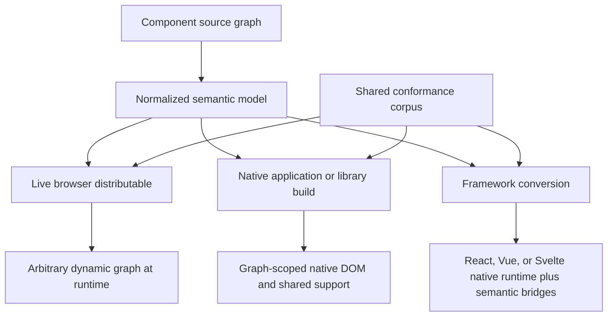
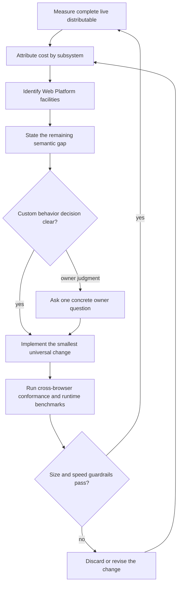

# Declarative Components Delivery Modes and Runtime Optimization - Plan

## Goal Capsule

- **Objective:** Authors can choose live browser execution, an optimized native application or library build, or framework conversion without any mode being mistaken for another during design, measurement, or optimization.
- **Means:** Define a shared delivery model and a separate normative specification, measurement contract, and tracked goal for each mode; then optimize the complete live browser distributable against native platform capabilities. (KTD1-KTD3)
- **Authority:** The Product Contract below defines the delivery modes and optimization boundaries; `packages/html-next/docs/spec/` owns normative behavior; cross-target conformance tests own observable equivalence.
- **Execution profile:** Land the mode specifications and tracker first, then use a measurement-first optimization loop on the live distributable. Each custom browser layer requires evidence of the platform gap and owner review when its necessity or semantics remain uncertain.
- **Stop condition:** Stop for a proposed optimization that removes a supported live capability, depends on a closed application graph, exceeds the repository performance guardrail, or requires an unresolved product decision.

---

## Product Contract

### Summary

Declarative Components has three delivery modes over one language: a complete browser distributable for arbitrary dynamic graphs, a native compiler for application or library graphs, and converters for React, Vue, and Svelte. Each mode has its own optimization boundary and measurements. The active optimization goal is the complete live distributable.

### Problem Frame

The current runtime work mixed universal browser-runtime optimization with closed-graph code generation. Both matter, but they answer different questions. A small generated fixture can prove that a compiler removed unused features while saying nothing about whether the complete distributable contains redundant machinery. That mismatch redirected the active work away from the requested goal: using the browser itself to minimize code that every live distribution can avoid.

### Key Decisions

- **Three delivery modes receive independent contracts and goals.** (session-settled: user-directed — chosen over one generated-output optimization program: live execution, native compilation, and framework conversion have different inputs and legitimate optimization boundaries.) Governs R1-R4.
- **The complete live distributable is the active optimization target.** (session-settled: user-directed — chosen over continuing closed-graph feature pruning: the requested goal is to remove runtime machinery that no full live distribution needs because the Web Platform already supplies it.) Governs R5-R9 and R17-R19.
- **Native compilation operates on an application or library graph.** (session-settled: user-directed — chosen over treating one component as the build unit: shared support and pruning are properties of the complete build graph.) Governs R10-R13.
- **Framework conversion is a first-class delivery mode.** (session-settled: user-directed — chosen over folding framework output into the native-build runtime model: React, Vue, and Svelte provide their own rendering, reactivity, and lifecycle primitives.) Governs R14-R16.

### Requirements

**Shared delivery contract**

- R1. All three delivery modes consume the same normalized component language and preserve the same observable native roots, projected content, state results, events, methods, validation, lifecycle, styles, and hydration behavior.
- R2. The delivery-mode overview routes authors to the correct mode from their input and deployment constraints.
- R3. Every optimization measurement names its delivery mode, input graph assumptions, included capabilities, browser targets, and bundle boundary.
- R4. Capability fixtures remain attribution tools and never define a per-component runtime architecture.

**Live browser distributable**

- R5. A single distributable can discover, load, parse, mount, update, disconnect, and reconnect any conforming component graph introduced at runtime.
- R6. The live distributable supports the complete implemented capability profile without build-time knowledge of the application's components.
- R7. Live optimization may compose native DOM, parsing, events, scheduling, validation, loading, lifecycle, and security facilities while preserving the public language and controller contracts.
- R8. Every retained custom browser subsystem records the native facilities considered, the precise semantic gap, its full-bundle contribution, its representative runtime cost, and the owner decision when judgment is required.
- R9. Progressive internal loading may become a live-distributable packaging strategy only when linking the public distributable still makes the complete capability set available for arbitrary later graphs with deterministic failure and CSP behavior.

**Native application and library build**

- R10. A native build starts from application entries or a concrete set of library entries and follows the complete component, controller, style, and static module graph.
- R11. The native build computes the union of capabilities required across that graph and emits shared build-scoped support rather than independent bespoke runtimes for each component.
- R12. Application output can serve as the application's complete UI runtime; library output preserves independently consumable entries and granular imports that a consumer bundler can deduplicate.
- R13. A native build that permits unknown runtime component definitions includes an explicit universal-runtime boundary or dynamic capability-loading contract.

**Framework conversion**

- R14. React, Vue, and Svelte conversion maps the normalized graph onto target-native rendering, reactivity, lifecycle, event, and hydration facilities.
- R15. Framework output carries compatibility bridges only for HTML Next semantics the target does not supply, while preserving the uniform public component and controller contracts.
- R16. Converter measurements report generated application or library output with the target framework separated from HTML Next bridge cost.

**Tracking and optimization discipline**

- R17. A durable tracker keeps the three goals, baselines, metrics, decisions, and next evidence separate.
- R18. The live optimization loop counts only reductions that apply to the complete live distributable; native-build pruning and target-framework reuse are recorded under their own goals.
- R19. The live goal is complete when every custom subsystem has a current native-first disposition, the full distributable is smaller than its 33,199-byte gzip baseline, conformance remains complete, runtime guardrails pass, and no known universally redundant layer remains.

### Success Criteria

- The specification index links one shared delivery overview and three detailed mode specifications.
- The goal tracker identifies the live-distributable track as active and reports the native-build and framework-conversion tracks independently.
- Full-distributable size output cannot be confused with capability-fixture or framework-target output.
- The complete live distributable falls below the 33,199-byte gzip baseline without dropping a supported capability or using application-graph knowledge.
- Chromium, Firefox, and WebKit conformance remains green, and no accepted hot-path change violates the repository's size-versus-speed guardrail.

### Scope Boundaries

The active implementation covers delivery-mode specifications, measurement separation, native-first auditing, and universal live-distributable reductions.

#### Deferred to Follow-Up Work

- Graph-wide capability specialization and shared native-build runtime generation proceed under the native application/library build goal.
- React, Vue, and Svelte bridge-size optimization proceeds under the framework-conversion goal.
- Progressive live-distributable loading remains a packaging experiment after the monolithic full-capability baseline is minimized and measured.

### Acceptance Examples

AE1 and AE5 are acceptance for the active live-distributable milestone. AE2-AE4 define the acceptance contracts owned by the separately tracked native-build and framework-conversion goals; this milestone specifies and tracks those contracts but does not implement them.

- AE1. Given a page that links the live distributable and later adds a previously unseen conforming component graph, when its definitions and instances appear, then every implemented capability works without a build or graph manifest. Covers R5-R9.
- AE2. Given an application entry graph containing several components, when the native compiler builds it, then shared runtime support is emitted once for the graph's capability union and observable behavior matches live execution. Covers R10-R13.
- AE3. Given a component library with independently imported entries, when a consumer bundles a subset, then shared support is deduplicated and entry contracts remain stable. Covers R10-R12.
- AE4. Given the same component graph converted to React, Vue, and Svelte, when each target mounts and hydrates it, then target-native primitives produce the same observable contract and HTML Next bridge cost is reported separately. Covers R14-R16.
- AE5. Given a proposed live-runtime size reduction, when its evidence relies on excluding a feature absent from a known graph, then it is recorded under the native-build goal and does not count toward the live-distributable result. Covers R3, R4, R17-R19.

---

## Planning Contract

### Key Technical Decisions

- KTD1. **Normative mode specifications stay separate.** Add one overview plus dedicated live-distributable, native-build, and framework-conversion specifications. The overview owns shared semantics and routes readers; each mode document owns its input boundary, runtime model, artifacts, optimization rules, failure behavior, and measurements. (session-settled: user-directed — chosen over one document organized around generated fixtures: separate contracts prevent optimizations from crossing delivery boundaries.)
- KTD2. **Measurements carry a delivery-mode identity.** Full live-distributable size and performance, native-build capability attribution, whole-graph native output, and framework bridge cost are distinct result groups. Existing isolated fixtures move under native-build attribution while the live result becomes the active headline.
- KTD3. **The live optimizer has no closed-world input.** A live cut must work for arbitrary future definitions and every supported capability. It may remove duplication, delegate to native behavior, share realm/document infrastructure, or improve algorithms; it may not assume a known component graph. (session-settled: user-directed — chosen over capability pruning as the active size method: only universally avoidable runtime code advances the requested goal.)
- KTD4. **One conformance spine serves every mode.** Shared fixtures state observable behavior once; live, native, React, Vue, and Svelte harnesses apply those cases at their respective delivery boundaries.
- KTD5. **Native builds optimize the graph, not the component.** The compiler derives one capability union and shared support plan for an application or library output. Per-component modules may import granular helpers, but their public host contract stays uniform and bundlers can combine the imports.
- KTD6. **Framework converters use target-native facilities.** Target adapters express the normalized execution plan through each framework and retain only compatibility bridges for semantics the framework cannot express directly.
- KTD7. **Custom live behavior remains evidence-gated.** The runtime audit records existing platform mechanisms before a custom implementation is retained or added. A semantic or performance tradeoff outside the settled guardrails returns to the owner as one concrete question.

### High-Level Technical Design

#### Delivery topology

#### Live native-first optimization loop

### System-Wide Impact

- Authors gain an explicit choice among no-build live execution, native compilation, and framework conversion without changing source semantics.
- Maintainers gain mode-specific ownership for size regressions, compatibility bridges, and conformance failures.
- Benchmark results become comparable only within a declared delivery boundary; existing historical numbers remain evidence with their original boundary named.
- Package entry points may eventually expose separate live, compiler, and converter surfaces, but this plan does not require repository or package fragmentation.

### Risks and Dependencies

- The full live bundle can shrink while a hot path regresses; the repository's combined size-and-speed guardrail remains authoritative.
- A native browser API may exist in only some target engines or expose a different policy. Cross-browser parity decides whether delegation is universal, conditional with an equivalent fallback, or unsuitable.
- Module attribution is minified raw size while release impact is whole-bundle gzip. Both are required because compressed bytes cannot be assigned reliably to individual modules.
- A progressive loader can reduce initial transfer while increasing requests, CSP complexity, and delayed failure. It remains separate from eliminating universally redundant runtime machinery.

### Sources and Research

- `packages/html-next/src/browser-loader.ts`, `browser-source.ts`, `parser.ts`, and `runtime.ts` define the current full live path.
- `packages/html-next/scripts/measure-runtime-size.ts` reports the 33,199-byte gzip live baseline and isolated native-build capability fixtures.
- `packages/html-next/docs/native-runtime-audit.md` records current native facilities, module attribution, and owner decisions.
- `packages/html-next/docs/runtime-performance.md` owns the size-versus-speed guardrails.
- `packages/html-next/docs/spec/targets-and-conformance.md` owns current cross-target equivalence.
- `packages/html-next/docs/plans/2026-09-12-1008-feat-full-reference-implementation-plan.md` establishes one normalized language, live execution, native targets, framework adapters, and shared conformance.

---

## Implementation Units

### U1. Specify and track the three delivery modes

- **Goal:** Give each delivery mechanism a detailed normative contract and independent tracked goal.
- **Requirements:** R1-R18; KTD1, KTD2, KTD5, KTD6.
- **Dependencies:** None.
- **Files:** `README.md`; `packages/html-next/README.md`; `packages/html-next/docs/spec/index.md`; `packages/html-next/docs/spec/delivery-modes.md`; `packages/html-next/docs/spec/live-browser-distributable.md`; `packages/html-next/docs/spec/native-application-build.md`; `packages/html-next/docs/spec/framework-conversion.md`; `packages/html-next/docs/delivery-goals.md`; `packages/html-next/docs/native-runtime-audit.md`; `packages/html-next/tests/spec.test.ts`.
- **Approach:** Put shared semantic authority and routing in the overview. Give every mode its own inputs, graph openness, runtime model, output artifacts, lifecycle, security boundary, optimization rules, measurements, and conformance cases. Make the tracker the concise operational index for baselines and next evidence.
- **Test scenarios:**
  - The spec-index test requires all four delivery documents and validates their internal links.
  - Each delivery specification names its input boundary, capability contract, optimization boundary, and measurement boundary.
  - The tracker links each mode to its specification and keeps the 33,199-byte gzip baseline exclusively on the live goal.
- **Verification:** A reader can classify an intended deployment into exactly one primary mode and can identify which measurements and optimizations apply to it.

### U2. Separate live and build-time measurement contracts

- **Goal:** Make the full live distributable the active runtime metric while preserving isolated native-build feature attribution.
- **Requirements:** R3, R4, R17-R19; KTD2, KTD3.
- **Dependencies:** U1.
- **Files:** `packages/html-next/scripts/measure-runtime-size.ts`; `packages/html-next/docs/runtime-performance.md`; `packages/html-next/docs/native-runtime-audit.md`; `packages/html-next/package.json`; `package.json`; `packages/html-next/tests/runtime-size.test.ts`; `.context/compound-engineering/ce-optimize/runtime-size/spec.yaml`; `.context/compound-engineering/ce-optimize/runtime-size/experiment-log.yaml`; `.context/compound-engineering/ce-optimize/live-runtime-size/spec.yaml`.
- **Approach:** Emit separate named result groups for the complete live distributable, native-build capability fixtures, and module attribution. Add an assertion that the live artifact exposes the complete supported capability profile so closed-graph pruning cannot satisfy its gate. Preserve the completed `runtime-size` profile and its experiment history as native-build attribution evidence; create a fresh `live-runtime-size` profile whose primary metric is complete live gzip and whose mutable scope covers the audited live dependency path plus its measurement contract.
- **Execution note:** Begin with a measurement-output test that fails when mode identity or the live capability assertion is absent.
- **Test scenarios:**
  - The live measurement bundles the public browser-loader entry and reports one full-capability gzip result.
  - Capability fixtures remain available under the native-build group and retain their existing specialized/fallback evidence.
  - Removing a supported live subsystem from the measured entry fails the completeness assertion even when gzip improves.
  - Reordering JSON output or rerunning on the same source produces stable metric names and equivalent values within the documented noise policy.
- **Verification:** CI reports an unambiguous full live baseline and refuses to count build-time capability exclusion as a live-runtime reduction.

### U3. Audit the complete live dependency path

- **Goal:** Give every byte-bearing live subsystem a current native-first disposition before further cuts are credited.
- **Requirements:** R5-R8, R18, R19; KTD3, KTD7.
- **Dependencies:** U2.
- **Files:** `packages/html-next/docs/native-runtime-audit.md`; `packages/html-next/scripts/audit-native-features.ts`; `packages/html-next/scripts/measure-runtime-size.ts`; `packages/html-next/tests/native-feature-audit.test.ts`.
- **Approach:** Attribute the browser-loader dependency graph, group modules by observable responsibility, probe the target browsers for candidate native facilities, and record the exact remaining gap. Separate universal reductions from conditional compatibility and build-only pruning. Ask the owner only when retaining or adding custom behavior requires a semantic choice.
- **Test scenarios:**
  - Every module contributing to the live bundle belongs to one audited subsystem and the attribution sum matches the bundler metadata.
  - Chromium, Firefox, and WebKit probes report support plus discriminating behavior for each candidate native facility.
  - A conditional native path proves output and error parity with its fallback before it is accepted.
  - An unaudited new live dependency fails the audit gate.
- **Verification:** The ledger has no unclassified live module and every custom layer has evidence, an owner-approved disposition, or one explicit pending decision.

### U4. Minimize live parsing and normalization

- **Goal:** Remove browser-redundant parsing and intermediate representation work while preserving arbitrary dynamic definitions and diagnostics.
- **Requirements:** R5-R8, R18, R19; KTD3, KTD4, KTD7.
- **Dependencies:** U3.
- **Files:** `packages/html-next/src/browser-source.ts`; `packages/html-next/src/parser.ts`; `packages/html-next/src/contract.ts`; `packages/html-next/src/language.ts`; `packages/html-next/tests/parser.test.ts`; `packages/html-next/tests/browser-loader.test.ts`; `packages/html-next/tests/conformance/`.
- **Approach:** Measure DOM-to-source adaptation, declaration parsing, contract construction, and diagnostic generation separately. Prefer direct DOM state, native attribute reflection, template inertness, selector/query facilities, and shared normalized builders where they replace duplicated browser-only structures. Retain proposal grammar and stable diagnostics as explicit semantic work.
- **Execution note:** Characterize browser-versus-Node definition and diagnostic parity before changing parser boundaries.
- **Test scenarios:**
  - Inline, fetched, nested, and later-added definitions normalize identically in every target browser.
  - Valid definitions preserve all declarations, template identity, source locations needed by diagnostics, and dependency edges.
  - Invalid grammar produces the same stable diagnostic codes and fails before authored content becomes live.
  - Large definition graphs show reduced allocation or parse time alongside reduced full-bundle gzip.
- **Verification:** Accepted cuts lower the complete live artifact and pass parser, security, graph, and cross-browser conformance without graph-specific pruning.

### U5. Minimize live execution and lifecycle

- **Goal:** Reduce universal runtime orchestration while retaining the complete reactive, structural, controller, hydration, and disconnect/reconnect contract.
- **Requirements:** R5-R8, R18, R19; KTD3, KTD4, KTD7.
- **Dependencies:** U3.
- **Files:** `packages/html-next/src/runtime.ts`; `packages/html-next/src/reactivity.ts`; `packages/html-next/src/data.ts`; `packages/html-next/src/controller.ts`; `packages/html-next/tests/runtime.test.ts`; `packages/html-next/tests/browser-loader.test.ts`; `packages/html-next/scripts/measure-hydration.ts`.
- **Approach:** Attribute connection coordination, dependency tracking, scheduling, state projection, structural reconciliation, controller hosting, and hydration separately. Reuse shared document observation, DOM identity, native event propagation, native collections, microtasks, cancellation, and connection state wherever they preserve the full dynamic contract.
- **Execution note:** Keep the cross-browser lifecycle and hydration identity tests active during every cut; size-only evidence is insufficient.
- **Test scenarios:**
  - One realm/document observer discovers arbitrary later definitions and instances while balancing controller and effect cleanup.
  - State, computed values, effects, data reads, keyed lists, events, and forms remain available in the same live artifact.
  - Detach, reconnect, reorder, adoption, and disposal preserve identity and execute cleanup exactly once per lifecycle transition.
  - Mutation-heavy and reactive fan-out benchmarks stay within the repository performance guardrail.
- **Verification:** Accepted cuts lower full live gzip or runtime cost, preserve the complete capability profile, and do not rely on knowledge of application entries.

### U6. Minimize live compatibility and policy layers

- **Goal:** Reduce the remaining universal validation, sanitization, styling, type/schema, and resource-graph layers through native composition and shared policy.
- **Requirements:** R5-R9, R18, R19; KTD3, KTD7.
- **Dependencies:** U3.
- **Files:** `packages/html-next/src/validate.ts`; `packages/html-next/src/validity.ts`; `packages/html-next/src/sanitize.ts`; `packages/html-next/src/style.ts`; `packages/html-next/src/type-system.ts`; `packages/html-next/src/json-schema.ts`; `packages/html-next/src/graph.ts`; `packages/html-next/src/resolve.ts`; `packages/html-next/src/browser-loader.ts`; `packages/html-next/tests/validity.test.ts`; `packages/html-next/tests/native-feature-audit.test.ts`; `packages/html-next/tests/graph.test.ts`.
- **Approach:** Evaluate each layer independently against browser behavior and measured hot paths. Preserve the approved custom sanitizer until target engines expose equivalent policy control. Preserve pure generalized validation where per-check native delegation violates the speed guardrail. Share parsing and policy representations when two retained layers encode the same rule.
- **Test scenarios:**
  - Native controls and generalized elements retain cross-browser validity parity and selector behavior.
  - Dynamic HTML produces one policy-consistent result across Chromium, Firefox, and WebKit.
  - Scoped styles preserve component, nested-root, projection, and generalized-validity matching.
  - Component and controller graphs preserve canonicalization, cycle handling, trust roots, redirects, CORS, CSP, and native ESM behavior.
  - Type and schema errors keep stable paths and diagnostic codes after representation sharing.
- **Verification:** Every accepted change satisfies both whole-bundle size evidence and representative runtime-cost evidence, with owner decisions recorded for retained custom behavior.

### U7. Close the live-distributable milestone

- **Goal:** Establish a defensible minimized full-capability release baseline and leave the other delivery goals independently actionable.
- **Requirements:** R1-R19; KTD1-KTD7.
- **Dependencies:** U1-U6.
- **Files:** `packages/html-next/docs/delivery-goals.md`; `packages/html-next/docs/native-runtime-audit.md`; `packages/html-next/docs/runtime-performance.md`; `README.md`; `.github/workflows/ci.yml`.
- **Approach:** Re-run the complete quality matrix, reconcile the audit with measured output, remove abandoned experiment code, and record the new full-live baseline. Preserve native-build and framework-conversion baselines and next evidence in their own tracker entries.
- **Test scenarios:**
  - A full live graph exercising every supported capability loads through the public distributable in all three engines.
  - Whole-repository verification, target parity, consumer packaging, hydration, reactive edge-case, and benchmark suites pass from a clean checkout.
  - The measured live gzip value is below 33,199 bytes and every credited reduction is universal to the full distributable.
  - The tracker links every retained custom subsystem to its current evidence or explicit owner decision.
- **Verification:** The live goal meets R19, all abandoned paths are removed, and the native-build and framework-conversion goals remain separate rather than inheriting the live result.

---

## Verification Contract

| Area | Verification | Completion signal |
| --- | --- | --- |
| Specification | `pnpm check:spec` | Delivery documents are indexed and linked, and the existing support profile remains valid |
| Core quality | `pnpm verify:inner` | Lint, TypeScript, active unit tests, generated checks, and size gates pass |
| Pull-request matrix | `pnpm verify:pr` | Foundation, package, dependency, consumer, and policy checks pass |
| Live browsers | `pnpm test:browser` | Chromium, Firefox, and WebKit pass the complete live capability corpus |
| Target parity | `pnpm test:targets` | Native, React, Vue, and Svelte preserve the shared observable contract |
| Native audit | `pnpm --filter @nextwebwg/html-next audit:native` | Browser feature behavior and fallback evidence are current |
| Runtime measurement | `pnpm --filter @nextwebwg/html-next measure:runtime` | Full live, native-build attribution, and module costs are reported under distinct identities |
| Hydration | `pnpm --filter @nextwebwg/html-next measure:hydration` | Adoption preserves identity, edits, focus, and selection in every target engine |

The target-parity command protects the behavior already implemented by each target; it does not claim graph-wide native-build or target-native converter completion. Those delivery goals own AE2-AE4 and expand this shared corpus as they are implemented.

The active live milestone requires a full-distributable gzip result below 33,199 bytes, complete supported-capability coverage, and no accepted hot-path regression outside `AGENTS.md` guardrails.

---

## Definition of Done

- The shared delivery overview, three detailed specifications, and independent goal tracker are committed and linked from the package documentation.
- Each mode has explicit inputs, graph assumptions, runtime ownership, output artifacts, optimization boundaries, failure behavior, conformance cases, and measurements.
- The full live distributable remains capable of running arbitrary dynamic component graphs with every supported declarative feature.
- Every live subsystem has a native-first audit disposition and every retained custom semantic choice has the required owner record.
- The live gzip baseline is lower than 33,199 bytes and runtime benchmarks satisfy the repository guardrails.
- Native-build specialization and framework conversion remain independently tracked and do not contribute reductions to the live result.
- Existing cross-browser, target, package-consumer, hydration, reactive edge-case, and repository verification suites pass; separately tracked native-build and framework-conversion work owns the additional acceptance needed for AE2-AE4.
- Dead-end experiments, temporary instrumentation, stale generated output, and abandoned helper code are removed.
